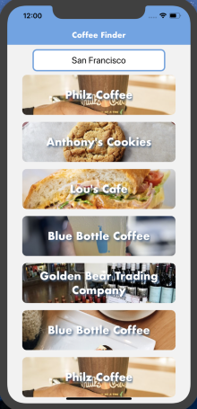
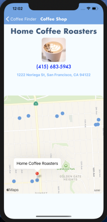

# COFFEE FINDER
A React Native Application to search for Coffee Shops based on location.

 

# Description

Out of a desire to search local coffee shops based on location and ease, I have created the world renown Coffee Finder. Users can enter a location and the app will search for businesses that serve coffee. After clicking on a specific coffee shop, you can call the business via the mobile device's phone application. A user can also click on the dropped pin on the map, and the app will link to the device's mapping application (Apple Maps, or Google Maps), immediately giving directions. Users will be able to get names of nearby coffee shops by click on the blue markers on the map.

## Technologies used

React Native

Expo

## Experience

Best Experienced on a mobile device with iOS or an iOS Simulator using XCode

## Dependencies

node.js

iOS simulator (xCode)

expo cli `npm install -g expo-cli` verify by running `expo whoami`

# Instructions

clone the repo - https://github.com/coloradorca/CoffeeFinder.git

\$ cd CoffeeFinder

npm install

obtain a [yelp fusion api key](https://www.yelp.com/fusion)

update keys.example.js with `yelpKey = 'Bearer (your api key)'`

npm run ios
